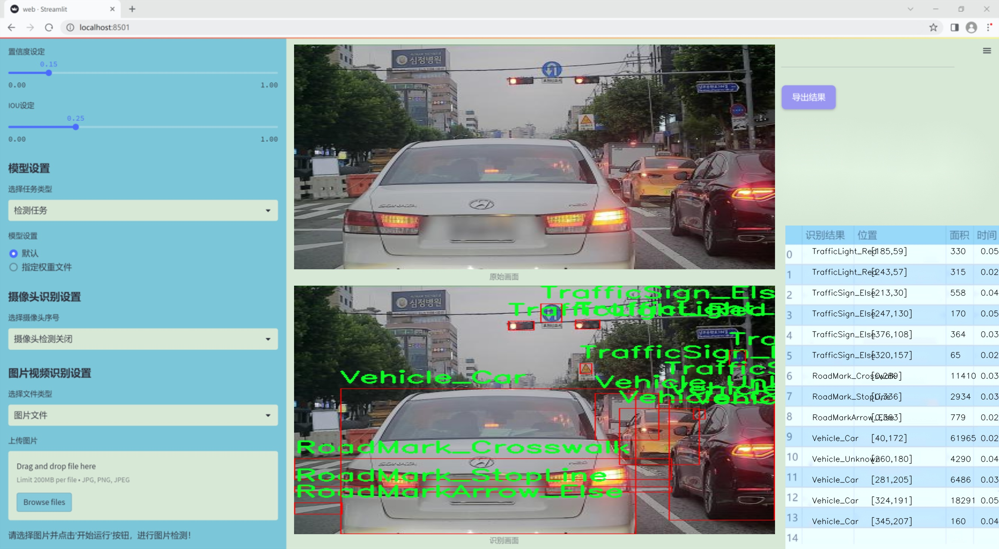
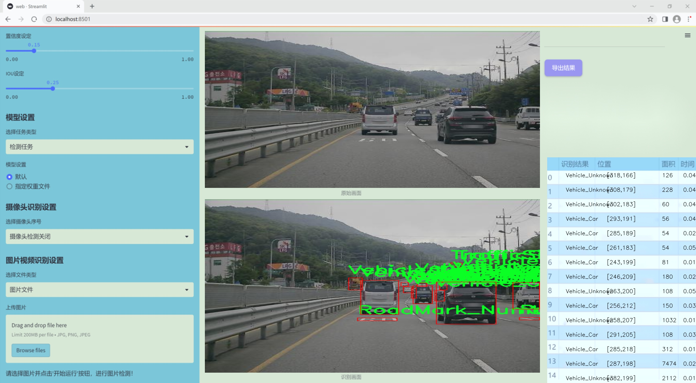
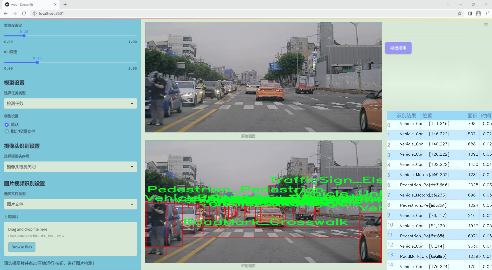
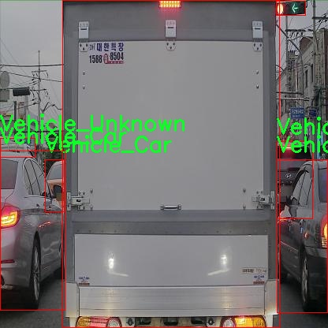
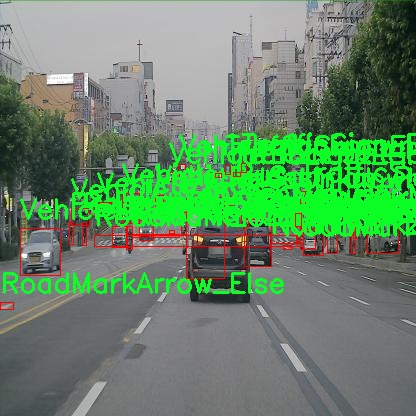
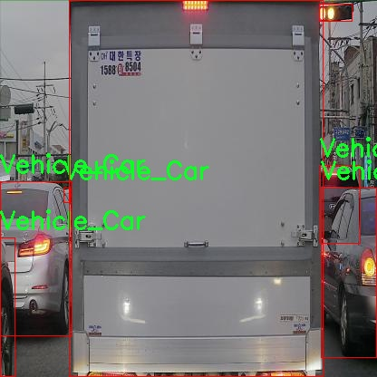
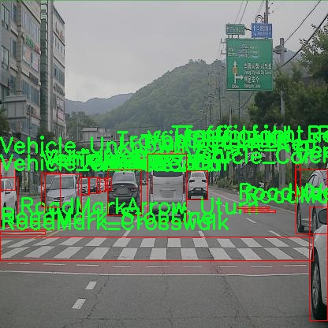
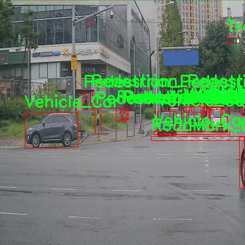

### 1.背景意义

研究背景与意义

随着城市化进程的加快，交通管理面临着日益严峻的挑战。交通事故频发、拥堵加剧以及环境污染等问题亟需通过智能化手段进行有效解决。近年来，计算机视觉技术的迅猛发展为交通场景的智能监测提供了新的解决方案。YOLO（You Only Look Once）系列模型因其高效的实时目标检测能力，成为交通监测领域的重要工具。尤其是YOLOv11模型的推出，进一步提升了目标检测的精度和速度，为智能交通系统的构建奠定了基础。

本研究旨在基于改进的YOLOv11模型，构建一个高效的交通场景智能监测系统。该系统将利用包含7300幅图像的多类别数据集，涵盖行人、自行车、各种交通标志和信号灯、以及多种类型的车辆等多个类别。这些数据的多样性和丰富性为模型的训练提供了良好的基础，使其能够在复杂的交通环境中实现高精度的目标检测。

通过对交通场景的实时监测，智能监测系统不仅能够有效识别交通参与者及其行为，还能及时反馈交通信号和标志的状态。这将为交通管理部门提供有力的数据支持，帮助其优化交通流量、提高道路安全性，并减少交通事故的发生。此外，系统的应用还将促进智能交通系统的进一步发展，推动城市交通管理向智能化、自动化的方向迈进。

综上所述，基于改进YOLOv11的交通场景智能监测系统的研究，不仅具有重要的理论意义，也具备广泛的实际应用价值。通过本项目的实施，期望能够为未来的智能交通解决方案提供新的思路和技术支持。

### 2.视频效果

[2.1 视频效果](https://www.bilibili.com/video/BV1eAmqYpETA/)

### 3.图片效果







##### [项目涉及的源码数据来源链接](https://kdocs.cn/l/cszuIiCKVNis)**

注意：本项目提供训练的数据集和训练教程,由于版本持续更新,暂不提供权重文件（best.pt）,请按照6.训练教程进行训练后实现上图演示的效果。

### 4.数据集信息

##### 4.1 本项目数据集类别数＆类别名

nc: 25
names: ['Pedestrian_Bicycle', 'Pedestrian_Pedestrian', 'RoadMarkArrow_Else', 'RoadMarkArrow_Left', 'RoadMarkArrow_Right', 'RoadMarkArrow_Straight', 'RoadMarkArrow_StraightLeft', 'RoadMarkArrow_StraightRight', 'RoadMarkArrow_Uturn', 'RoadMark_Character', 'RoadMark_Crosswalk', 'RoadMark_Number', 'RoadMark_StopLine', 'TrafficLight_Arrow', 'TrafficLight_Green', 'TrafficLight_GreenArrow', 'TrafficLight_Red', 'TrafficLight_RedArrow', 'TrafficLight_Yellow', 'TrafficSign_Else', 'TrafficSign_Speed', 'Vehicle_Bus', 'Vehicle_Car', 'Vehicle_Motorcycle', 'Vehicle_Unknown']


该项目为【目标检测】数据集，请在【训练教程和Web端加载模型教程（第三步）】这一步的时候按照【目标检测】部分的教程来训练

##### 4.2 本项目数据集信息介绍

本项目数据集信息介绍

本项目所使用的数据集名为“Yolo_detection45”，旨在为改进YOLOv11的交通场景智能监测系统提供强有力的支持。该数据集包含25个类别，涵盖了交通监测中常见的多种对象类型，确保了系统在实际应用中的广泛适用性和高效性。具体而言，数据集中包括行人和自行车（Pedestrian_Bicycle）、不同类型的行人（Pedestrian_Pedestrian），以及多种道路标志箭头（如RoadMarkArrow_Else、RoadMarkArrow_Left、RoadMarkArrow_Right等），这些元素对于交通流的指引和管理至关重要。

此外，数据集还包含多种道路标记，如道路字符（RoadMark_Character）、人行横道（RoadMark_Crosswalk）、停车线（RoadMark_StopLine）等，这些信息有助于系统识别和理解交通规则的执行情况。交通信号灯的不同状态（如TrafficLight_Green、TrafficLight_Red、TrafficLight_Yellow等）也被纳入数据集中，以便系统能够实时监测和响应交通信号的变化，从而提高行车安全性。

车辆类别方面，数据集涵盖了多种交通工具，包括公交车（Vehicle_Bus）、小汽车（Vehicle_Car）、摩托车（Vehicle_Motorcycle）以及未知类型的车辆（Vehicle_Unknown）。这种多样性使得系统能够在复杂的交通环境中有效识别和分类不同的交通参与者，从而为智能监测提供更为全面的数据支持。

综上所述，“Yolo_detection45”数据集不仅在类别数量上具有丰富性，还在类别的多样性和复杂性上展现了其在交通场景智能监测中的重要价值。这些数据将为改进YOLOv11模型的训练提供坚实的基础，助力实现更高效、更智能的交通管理解决方案。











### 5.全套项目环境部署视频教程（零基础手把手教学）

[5.1 所需软件PyCharm和Anaconda安装教程（第一步）](https://www.bilibili.com/video/BV1BoC1YCEKi/?spm_id_from=333.999.0.0&vd_source=bc9aec86d164b67a7004b996143742dc)


[5.2 安装Python虚拟环境创建和依赖库安装视频教程（第二步）](https://www.bilibili.com/video/BV1ZoC1YCEBw?spm_id_from=333.788.videopod.sections&vd_source=bc9aec86d164b67a7004b996143742dc)

### 6.改进YOLOv11训练教程和Web_UI前端加载模型教程（零基础手把手教学）

[6.1 改进YOLOv11训练教程和Web_UI前端加载模型教程（第三步）](https://www.bilibili.com/video/BV1BoC1YCEhR?spm_id_from=333.788.videopod.sections&vd_source=bc9aec86d164b67a7004b996143742dc)


按照上面的训练视频教程链接加载项目提供的数据集，运行train.py即可开始训练



     Epoch   gpu_mem       box       obj       cls    labels  img_size
     1/200     20.8G   0.01576   0.01955  0.007536        22      1280: 100%|██████████| 849/849 [14:42<00:00,  1.04s/it]
               Class     Images     Labels          P          R     mAP@.5 mAP@.5:.95: 100%|██████████| 213/213 [01:14<00:00,  2.87it/s]
                 all       3395      17314      0.994      0.957      0.0957      0.0843

     Epoch   gpu_mem       box       obj       cls    labels  img_size
     2/200     20.8G   0.01578   0.01923  0.007006        22      1280: 100%|██████████| 849/849 [14:44<00:00,  1.04s/it]
               Class     Images     Labels          P          R     mAP@.5 mAP@.5:.95: 100%|██████████| 213/213 [01:12<00:00,  2.95it/s]
                 all       3395      17314      0.996      0.956      0.0957      0.0845

     Epoch   gpu_mem       box       obj       cls    labels  img_size
     3/200     20.8G   0.01561    0.0191  0.006895        27      1280: 100%|██████████| 849/849 [10:56<00:00,  1.29it/s]
               Class     Images     Labels          P          R     mAP@.5 mAP@.5:.95: 100%|███████   | 187/213 [00:52<00:00,  4.04it/s]
                 all       3395      17314      0.996      0.957      0.0957      0.0845


###### [项目数据集下载链接](https://kdocs.cn/l/cszuIiCKVNis)

### 7.原始YOLOv11算法讲解

##### YOLO11简介

> YOLO11源码地址：https://github.com/ultralytics/ultralytics

Ultralytics
YOLO11是一款尖端的、最先进的模型，它在之前YOLO版本成功的基础上进行了构建，并引入了新功能和改进，以进一步提升性能和灵活性。YOLO11设计快速、准确且易于使用，使其成为各种物体检测和跟踪、实例分割、图像分类以及姿态估计任务的绝佳选择。  


**YOLO11创新点如下:**

YOLO 11主要改进包括：  
`增强的特征提取`：YOLO 11采用了改进的骨干和颈部架构，增强了特征提取功能，以实现更精确的目标检测。  
`优化的效率和速度`：优化的架构设计和优化的训练管道提供更快的处理速度，同时保持准确性和性能之间的平衡。  
`更高的精度，更少的参数`：YOLO11m在COCO数据集上实现了更高的平均精度（mAP），参数比YOLOv8m少22%，使其在不影响精度的情况下提高了计算效率。  
`跨环境的适应性`：YOLO 11可以部署在各种环境中，包括边缘设备、云平台和支持NVIDIA GPU的系统。  
`广泛的支持任务`：YOLO 11支持各种计算机视觉任务，如对象检测、实例分割、图像分类、姿态估计和面向对象检测（OBB）。

**YOLO11不同模型尺寸信息：**

YOLO11 提供5种不同的型号规模模型，以满足不同的应用需求：

Model| size (pixels)| mAPval 50-95| Speed CPU ONNX (ms)| Speed T4 TensorRT10
(ms)| params (M)| FLOPs (B)  
---|---|---|---|---|---|---  
YOLO11n| 640| 39.5| 56.1 ± 0.8| 1.5 ± 0.0| 2.6| 6.5  
YOLO11s| 640| 47.0| 90.0 ± 1.2| 2.5 ± 0.0| 9.4| 21.5  
YOLO11m| 640| 51.5| 183.2 ± 2.0| 4.7 ± 0.1| 20.1| 68.0  
YOLO11l| 640| 53.4| 238.6 ± 1.4| 6.2 ± 0.1| 25.3| 86.9  
YOLO11x| 640| 54.7| 462.8 ± 6.7| 11.3 ± 0.2| 56.9| 194.9  
  
**模型常用训练超参数参数说明：**  
`YOLOv11
模型的训练设置包括训练过程中使用的各种超参数和配置`。这些设置会影响模型的性能、速度和准确性。关键的训练设置包括批量大小、学习率、动量和权重衰减。此外，优化器、损失函数和训练数据集组成的选择也会影响训练过程。对这些设置进行仔细的调整和实验对于优化性能至关重要。  
**以下是一些常用的模型训练参数和说明：**

参数名| 默认值| 说明  
---|---|---  
`model`| `None`| 指定用于训练的模型文件。接受指向 `.pt` 预训练模型或 `.yaml`
配置文件。对于定义模型结构或初始化权重至关重要。  
`data`| `None`| 数据集配置文件的路径（例如
`coco8.yaml`).该文件包含特定于数据集的参数，包括训练数据和验证数据的路径、类名和类数。  
`epochs`| `100`| 训练总轮数。每个epoch代表对整个数据集进行一次完整的训练。调整该值会影响训练时间和模型性能。  
`patience`| `100`| 在验证指标没有改善的情况下，提前停止训练所需的epoch数。当性能趋于平稳时停止训练，有助于防止过度拟合。  
`batch`| `16`| 批量大小，有三种模式:设置为整数(例如，’ Batch =16 ‘)， 60% GPU内存利用率的自动模式(’ Batch
=-1 ‘)，或指定利用率分数的自动模式(’ Batch =0.70 ')。  
`imgsz`| `640`| 用于训练的目标图像尺寸。所有图像在输入模型前都会被调整到这一尺寸。影响模型精度和计算复杂度。  
`device`| `None`| 指定用于训练的计算设备：单个 GPU (`device=0`）、多个 GPU (`device=0,1`)、CPU
(`device=cpu`)，或苹果芯片的 MPS (`device=mps`).  
`workers`| `8`| 加载数据的工作线程数（每 `RANK` 多 GPU 训练）。影响数据预处理和输入模型的速度，尤其适用于多 GPU 设置。  
`name`| `None`| 训练运行的名称。用于在项目文件夹内创建一个子目录，用于存储训练日志和输出结果。  
`pretrained`| `True`| 决定是否从预处理模型开始训练。可以是布尔值，也可以是加载权重的特定模型的字符串路径。提高训练效率和模型性能。  
`optimizer`| `'auto'`| 为训练模型选择优化器。选项包括 `SGD`, `Adam`, `AdamW`, `NAdam`,
`RAdam`, `RMSProp` 等，或 `auto` 用于根据模型配置进行自动选择。影响收敛速度和稳定性  
`lr0`| `0.01`| 初始学习率（即 `SGD=1E-2`, `Adam=1E-3`) .调整这个值对优化过程至关重要，会影响模型权重的更新速度。  
`lrf`| `0.01`| 最终学习率占初始学习率的百分比 = (`lr0 * lrf`)，与调度程序结合使用，随着时间的推移调整学习率。  


**各损失函数作用说明：**  
`定位损失box_loss`：预测框与标定框之间的误差（GIoU），越小定位得越准；  
`分类损失cls_loss`：计算锚框与对应的标定分类是否正确，越小分类得越准；  
`动态特征损失（dfl_loss）`：DFLLoss是一种用于回归预测框与目标框之间距离的损失函数。在计算损失时，目标框需要缩放到特征图尺度，即除以相应的stride，并与预测的边界框计算Ciou
Loss，同时与预测的anchors中心点到各边的距离计算回归DFLLoss。  


### 8.200+种全套改进YOLOV11创新点原理讲解

#### 8.1 200+种全套改进YOLOV11创新点原理讲解大全

由于篇幅限制，每个创新点的具体原理讲解就不全部展开，具体见下列网址中的改进模块对应项目的技术原理博客网址【Blog】（创新点均为模块化搭建，原理适配YOLOv5~YOLOv11等各种版本）

[改进模块技术原理博客【Blog】网址链接](https://gitee.com/qunmasj/good)


#### 8.2 精选部分改进YOLOV11创新点原理讲解

###### 这里节选部分改进创新点展开原理讲解(完整的改进原理见上图和[改进模块技术原理博客链接](https://gitee.com/qunmasj/good)【如果此小节的图加载失败可以通过CSDN或者Github搜索该博客的标题访问原始博客，原始博客图片显示正常】

### MS-Block简介
实时目标检测，以YOLO系列为例，已在工业领域中找到重要应用，特别是在边缘设备（如无人机和机器人）中。与之前的目标检测器不同，实时目标检测器旨在在速度和准确性之间追求最佳平衡。为了实现这一目标，提出了大量的工作：从第一代DarkNet到CSPNet，再到最近的扩展ELAN，随着性能的快速增长，实时目标检测器的架构经历了巨大的变化。

尽管性能令人印象深刻，但在不同尺度上识别对象仍然是实时目标检测器面临的基本挑战。这促使作者设计了一个强大的编码器架构，用于学习具有表现力的多尺度特征表示。具体而言，作者从两个新的角度考虑为实时目标检测编码多尺度特征：

从局部视角出发，作者设计了一个具有简单而有效的分层特征融合策略的MS-Block。受到Res2Net的启发，作者在MS-Block中引入了多个分支来进行特征提取，但不同的是，作者使用了一个带有深度卷积的 Inverted Bottleneck Block块，以实现对大Kernel的高效利用。

从全局视角出发，作者提出随着网络加深逐渐增加卷积的Kernel-Size。作者在浅层使用小Kernel卷积来更高效地处理高分辨率特征。另一方面，在深层中，作者采用大Kernel卷积来捕捉广泛的信息。

基于以上设计原则，作者呈现了作者的实时目标检测器，称为YOLO-MS。为了评估作者的YOLO-MS的性能，作者在MS COCO数据集上进行了全面的实验。还提供了与其他最先进方法的定量比较，以展示作者方法的强大性能。如图1所示，YOLO-MS在计算性能平衡方面优于其他近期的实时目标检测器。


具体而言，YOLO-MS-XS在MS COCO上获得了43%+的AP得分，仅具有450万个可学习参数和8.7亿个FLOPs。YOLO-MS-S和YOLO-MS分别获得了46%+和51%+的AP，可学习参数分别为810万和2220万。此外，作者的工作还可以作为其他YOLO模型的即插即用模块。通常情况下，作者的方法可以将YOLOv11的AP从37%+显著提高到40%+，甚至还可以使用更少的参数和FLOPs。

CSP Block是一个基于阶段级梯度路径的网络，平衡了梯度组合和计算成本。它是广泛应用于YOLO系列的基本构建块。已经提出了几种变体，包括YOLOv4和YOLOv11中的原始版本，Scaled YOLOv4中的CSPVoVNet，YOLOv11中的ELAN，以及RTMDet中提出的大Kernel单元。作者在图2(a)和图2(b)中分别展示了原始CSP块和ELAN的结构。


上述实时检测器中被忽视的一个关键方面是如何在基本构建块中编码多尺度特征。其中一个强大的设计原则是Res2Net，它聚合了来自不同层次的特征以增强多尺度表示。然而，这一原则并没有充分探索大Kernel卷积的作用，而大Kernel卷积已经在基于CNN的视觉识别任务模型中证明有效。将大Kernel卷积纳入Res2Net的主要障碍在于它们引入的计算开销，因为构建块采用了标准卷积。在作者的方法中，作者提出用 Inverted Bottleneck Block替代标准的3 × 3卷积，以享受大Kernel卷积的好处。

#### MS-Block

基于前面的分析，参考该博客提出了一个带有分层特征融合策略的全新Block，称为MS-Block，以增强实时目标检测器在提取多尺度特征时的能力，同时保持快速的推理速度。

MS-Block的具体结构如图2(c)所示。假设是输入特征。通过1×1卷积的转换后，X的通道维度增加到n*C。然后，作者将X分割成n个不同的组，表示为，其中。为了降低计算成本，作者选择n为3。

注意，除了之外，每个其他组都经过一个 Inverted Bottleneck Block层，用表示，其中k表示Kernel-Size，以获得。的数学表示如下：


根据这个公式，作者不将 Inverted Bottleneck Block层连接到，使其作为跨阶段连接，并保留来自前面层的信息。最后，作者将所有分割连接在一起，并应用1×1卷积来在所有分割之间进行交互，每个分割都编码不同尺度的特征。当网络加深时，这个1×1卷积也用于调整通道数。

#### Heterogeneous Kernel Selection Protocol
除了构建块的设计外，作者还从宏观角度探讨了卷积的使用。之前的实时目标检测器在不同的编码器阶段采用了同质卷积（即具有相同Kernel-Size的卷积），但作者认为这不是提取多尺度语义信息的最佳选项。

在金字塔结构中，从检测器的浅阶段提取的高分辨率特征通常用于捕捉细粒度语义，将用于检测小目标。相反，来自网络较深阶段的低分辨率特征用于捕捉高级语义，将用于检测大目标。如果作者在所有阶段都采用统一的小Kernel卷积，深阶段的有效感受野（ERF）将受到限制，影响大目标的性能。在每个阶段中引入大Kernel卷积可以帮助解决这个问题。然而，具有大的ERF的大Kernel可以编码更广泛的区域，这增加了在小目标外部包含噪声信息的概率，并且降低了推理速度。

在这项工作中，作者建议在不同阶段中采用异构卷积，以帮助捕获更丰富的多尺度特征。具体来说，在编码器的第一个阶段中，作者采用最小Kernel卷积，而最大Kernel卷积位于最后一个阶段。随后，作者逐步增加中间阶段的Kernel-Size，使其与特征分辨率的增加保持一致。这种策略允许提取细粒度和粗粒度的语义信息，增强了编码器的多尺度特征表示能力。

正如图所示，作者将k的值分别分配给编码器中的浅阶段到深阶段，取值为3、5、7和9。作者将其称为异构Kernel选择（HKS）协议。


作者的HKS协议能够在深层中扩大感受野，而不会对浅层产生任何其他影响。第4节的图4支持了作者的分析。此外，HKS不仅有助于编码更丰富的多尺度特征，还确保了高效的推理。

如表1所示，将大Kernel卷积应用于高分辨率特征会产生较高的计算开销。然而，作者的HKS协议在低分辨率特征上采用大Kernel卷积，从而与仅使用大Kernel卷积相比，大大降低了计算成本。


在实践中，作者经验性地发现，采用HKS协议的YOLO-MS的推理速度几乎与仅使用深度可分离的3 × 3卷积相同。


如图所示，作者模型的Backbone由4个阶段组成，每个阶段后面跟随1个步长为2的3 × 3卷积进行下采样。在第3个阶段后，作者添加了1个SPP块，与RTMDet中一样。在作者的编码器上，作者使用PAFPN作为Neck来构建特征金字塔[31, 35]。它融合了从Backbone不同阶段提取的多尺度特征。Neck中使用的基本构建块也是作者的MS-Block，在其中使用3 × 3深度可分离卷积进行快速推理。

此外，为了在速度和准确性之间取得更好的平衡，作者将Backbone中多级特征的通道深度减半。作者提供了3个不同尺度的YOLO-MS变体，即YOLO-MS-XS、YOLO-MS-S和YOLO-MS。不同尺度的YOLO-MS的详细配置列在表2中。对于YOLO-MS的其他部分，作者将其保持与RTMDet相同。


### 9.系统功能展示

图9.1.系统支持检测结果表格显示

  图9.2.系统支持置信度和IOU阈值手动调节

  图9.3.系统支持自定义加载权重文件best.pt(需要你通过步骤5中训练获得)

  图9.4.系统支持摄像头实时识别

  图9.5.系统支持图片识别

  图9.6.系统支持视频识别

  图9.7.系统支持识别结果文件自动保存

  图9.8.系统支持Excel导出检测结果数据


### 10. YOLOv11核心改进源码讲解

#### 10.1 starnet.py

以下是对代码中最核心部分的提取和详细中文注释：

```python
import torch
import torch.nn as nn
from timm.models.layers import DropPath, trunc_normal_

class ConvBN(torch.nn.Sequential):
    """
    组合卷积层和批归一化层的类
    """
    def __init__(self, in_planes, out_planes, kernel_size=1, stride=1, padding=0, dilation=1, groups=1, with_bn=True):
        super().__init__()
        # 添加卷积层
        self.add_module('conv', torch.nn.Conv2d(in_planes, out_planes, kernel_size, stride, padding, dilation, groups))
        # 如果需要，添加批归一化层
        if with_bn:
            self.add_module('bn', torch.nn.BatchNorm2d(out_planes))
            # 初始化批归一化层的权重和偏置
            torch.nn.init.constant_(self.bn.weight, 1)
            torch.nn.init.constant_(self.bn.bias, 0)

class Block(nn.Module):
    """
    StarNet中的基本模块，包含深度可分离卷积和元素级乘法
    """
    def __init__(self, dim, mlp_ratio=3, drop_path=0.):
        super().__init__()
        # 深度可分离卷积
        self.dwconv = ConvBN(dim, dim, 7, 1, (7 - 1) // 2, groups=dim, with_bn=True)
        # MLP的两个线性变换
        self.f1 = ConvBN(dim, mlp_ratio * dim, 1, with_bn=False)
        self.f2 = ConvBN(dim, mlp_ratio * dim, 1, with_bn=False)
        # MLP的输出层
        self.g = ConvBN(mlp_ratio * dim, dim, 1, with_bn=True)
        # 第二个深度可分离卷积
        self.dwconv2 = ConvBN(dim, dim, 7, 1, (7 - 1) // 2, groups=dim, with_bn=False)
        self.act = nn.ReLU6()  # 激活函数
        self.drop_path = DropPath(drop_path) if drop_path > 0. else nn.Identity()  # 随机深度

    def forward(self, x):
        input = x  # 保存输入
        x = self.dwconv(x)  # 经过深度可分离卷积
        x1, x2 = self.f1(x), self.f2(x)  # MLP的两个分支
        x = self.act(x1) * x2  # 元素级乘法
        x = self.dwconv2(self.g(x))  # 经过第二个深度可分离卷积
        x = input + self.drop_path(x)  # 残差连接
        return x

class StarNet(nn.Module):
    """
    StarNet网络结构
    """
    def __init__(self, base_dim=32, depths=[3, 3, 12, 5], mlp_ratio=4, drop_path_rate=0.0, num_classes=1000, **kwargs):
        super().__init__()
        self.num_classes = num_classes
        self.in_channel = 32
        # stem层
        self.stem = nn.Sequential(ConvBN(3, self.in_channel, kernel_size=3, stride=2, padding=1), nn.ReLU6())
        dpr = [x.item() for x in torch.linspace(0, drop_path_rate, sum(depths))]  # 随机深度
        # 构建各个阶段
        self.stages = nn.ModuleList()
        cur = 0
        for i_layer in range(len(depths)):
            embed_dim = base_dim * 2 ** i_layer  # 当前阶段的嵌入维度
            down_sampler = ConvBN(self.in_channel, embed_dim, 3, 2, 1)  # 下采样层
            self.in_channel = embed_dim
            blocks = [Block(self.in_channel, mlp_ratio, dpr[cur + i]) for i in range(depths[i_layer])]  # 当前阶段的Block
            cur += depths[i_layer]
            self.stages.append(nn.Sequential(down_sampler, *blocks))  # 将下采样层和Block组合

    def forward(self, x):
        features = []  # 存储特征
        x = self.stem(x)  # 经过stem层
        features.append(x)
        for stage in self.stages:
            x = stage(x)  # 经过每个阶段
            features.append(x)
        return features  # 返回所有阶段的特征

# 定义不同规模的StarNet模型
def starnet_s1(pretrained=False, **kwargs):
    model = StarNet(24, [2, 2, 8, 3], **kwargs)
    return model

def starnet_s2(pretrained=False, **kwargs):
    model = StarNet(32, [1, 2, 6, 2], **kwargs)
    return model

def starnet_s3(pretrained=False, **kwargs):
    model = StarNet(32, [2, 2, 8, 4], **kwargs)
    return model

def starnet_s4(pretrained=False, **kwargs):
    model = StarNet(32, [3, 3, 12, 5], **kwargs)
    return model
```

### 代码核心部分说明：
1. **ConvBN类**：组合卷积层和批归一化层，方便构建网络中的卷积模块。
2. **Block类**：StarNet的基本构建块，包含深度可分离卷积和元素级乘法，使用ReLU6激活函数和残差连接。
3. **StarNet类**：整个网络结构，包含stem层和多个阶段，每个阶段由下采样层和多个Block组成。
4. **模型构建函数**：提供不同规模的StarNet模型构建函数，方便用户根据需求创建不同的网络结构。


#### 10.1 wtconv2d.py

以下是代码中最核心的部分，并附上详细的中文注释：

```python
import torch
import torch.nn as nn
import torch.nn.functional as F
from torch.autograd import Function
import pywt

def create_wavelet_filter(wave, in_size, out_size, type=torch.float):
    # 创建小波滤波器
    w = pywt.Wavelet(wave)  # 使用pywt库创建小波对象
    # 反转小波的高通和低通滤波器
    dec_hi = torch.tensor(w.dec_hi[::-1], dtype=type)
    dec_lo = torch.tensor(w.dec_lo[::-1], dtype=type)
    # 生成分解滤波器
    dec_filters = torch.stack([dec_lo.unsqueeze(0) * dec_lo.unsqueeze(1),
                               dec_lo.unsqueeze(0) * dec_hi.unsqueeze(1),
                               dec_hi.unsqueeze(0) * dec_lo.unsqueeze(1),
                               dec_hi.unsqueeze(0) * dec_hi.unsqueeze(1)], dim=0)
    # 扩展滤波器以适应输入通道数
    dec_filters = dec_filters[:, None].repeat(in_size, 1, 1, 1)

    # 反转小波的重构滤波器
    rec_hi = torch.tensor(w.rec_hi[::-1], dtype=type).flip(dims=[0])
    rec_lo = torch.tensor(w.rec_lo[::-1], dtype=type).flip(dims=[0])
    # 生成重构滤波器
    rec_filters = torch.stack([rec_lo.unsqueeze(0) * rec_lo.unsqueeze(1),
                               rec_lo.unsqueeze(0) * rec_hi.unsqueeze(1),
                               rec_hi.unsqueeze(0) * rec_lo.unsqueeze(1),
                               rec_hi.unsqueeze(0) * rec_hi.unsqueeze(1)], dim=0)
    # 扩展滤波器以适应输出通道数
    rec_filters = rec_filters[:, None].repeat(out_size, 1, 1, 1)

    return dec_filters, rec_filters

def wavelet_transform(x, filters):
    # 执行小波变换
    b, c, h, w = x.shape  # 获取输入张量的形状
    pad = (filters.shape[2] // 2 - 1, filters.shape[3] // 2 - 1)  # 计算填充
    # 使用卷积进行小波变换
    x = F.conv2d(x, filters.to(x.dtype).to(x.device), stride=2, groups=c, padding=pad)
    x = x.reshape(b, c, 4, h // 2, w // 2)  # 重塑输出形状
    return x

def inverse_wavelet_transform(x, filters):
    # 执行逆小波变换
    b, c, _, h_half, w_half = x.shape  # 获取输入张量的形状
    pad = (filters.shape[2] // 2 - 1, filters.shape[3] // 2 - 1)  # 计算填充
    x = x.reshape(b, c * 4, h_half, w_half)  # 重塑输入形状
    # 使用转置卷积进行逆小波变换
    x = F.conv_transpose2d(x, filters.to(x.dtype).to(x.device), stride=2, groups=c, padding=pad)
    return x

class WaveletTransform(Function):
    @staticmethod
    def forward(ctx, input, filters):
        # 前向传播，执行小波变换
        ctx.filters = filters  # 保存滤波器以供反向传播使用
        with torch.no_grad():
            x = wavelet_transform(input, filters)  # 执行小波变换
        return x

    @staticmethod
    def backward(ctx, grad_output):
        # 反向传播，计算梯度
        grad = inverse_wavelet_transform(grad_output, ctx.filters)  # 执行逆小波变换
        return grad, None

class WTConv2d(nn.Module):
    def __init__(self, in_channels, out_channels, kernel_size=5, stride=1, bias=True, wt_levels=1, wt_type='db1'):
        super(WTConv2d, self).__init__()
        assert in_channels == out_channels  # 输入通道数必须等于输出通道数

        self.in_channels = in_channels
        self.wt_levels = wt_levels
        self.stride = stride

        # 创建小波滤波器
        self.wt_filter, self.iwt_filter = create_wavelet_filter(wt_type, in_channels, in_channels, torch.float)
        self.wt_filter = nn.Parameter(self.wt_filter, requires_grad=False)  # 不需要训练的小波滤波器
        self.iwt_filter = nn.Parameter(self.iwt_filter, requires_grad=False)  # 不需要训练的逆小波滤波器

        # 定义小波变换和逆小波变换的函数
        self.wt_function = wavelet_transform_init(self.wt_filter)
        self.iwt_function = inverse_wavelet_transform_init(self.iwt_filter)

        # 基础卷积层
        self.base_conv = nn.Conv2d(in_channels, in_channels, kernel_size, padding='same', stride=1, groups=in_channels, bias=bias)

    def forward(self, x):
        # 前向传播，执行小波变换和卷积操作
        for i in range(self.wt_levels):
            curr_x = self.wt_function(x)  # 执行小波变换
            # 处理后续操作...
        
        x = self.base_conv(x)  # 基础卷积操作
        return x
```

### 代码核心部分说明：
1. **小波滤波器创建**：`create_wavelet_filter` 函数用于生成小波变换和逆变换所需的滤波器。
2. **小波变换和逆变换**：`wavelet_transform` 和 `inverse_wavelet_transform` 函数分别实现小波变换和逆变换的核心逻辑。
3. **自定义函数**：`WaveletTransform` 类实现了小波变换的前向和反向传播，允许在神经网络中使用小波变换。
4. **卷积层**：`WTConv2d` 类是一个自定义的卷积层，结合了小波变换和卷积操作。

这个程序文件 `wtconv2d.py` 实现了一个基于小波变换的二维卷积层，主要用于图像处理和特征提取。代码中使用了 PyTorch 框架，并结合了小波变换的数学原理。以下是对代码的详细讲解。

首先，文件导入了必要的库，包括 PyTorch 的核心库和小波变换库 `pywt`。接着，定义了一个函数 `create_wavelet_filter`，用于生成小波变换和逆小波变换所需的滤波器。该函数接收小波类型、输入通道数和输出通道数作为参数，使用 `pywt` 库创建小波对象，并生成相应的滤波器。生成的滤波器被转换为 PyTorch 张量，并根据输入和输出通道数进行扩展。

接下来，定义了两个函数 `wavelet_transform` 和 `inverse_wavelet_transform`，分别用于执行小波变换和逆小波变换。它们通过卷积操作实现对输入张量的处理，利用了之前生成的滤波器。

然后，定义了两个类 `WaveletTransform` 和 `InverseWaveletTransform`，它们继承自 `torch.autograd.Function`。这两个类分别实现了小波变换和逆小波变换的前向和反向传播方法，以便在训练过程中计算梯度。

接着，定义了两个初始化函数 `wavelet_transform_init` 和 `inverse_wavelet_transform_init`，用于创建小波变换和逆小波变换的应用函数。

`WTConv2d` 类是这个文件的核心部分，继承自 `nn.Module`。在其构造函数中，首先检查输入和输出通道数是否相等。然后，创建小波滤波器和逆小波滤波器，并将其设置为不可训练的参数。接下来，初始化了基本的卷积层和小波卷积层，并定义了一个可选的步幅处理方法。

在 `forward` 方法中，首先初始化了用于存储小波变换和逆小波变换结果的列表。然后，进行多层小波变换，将输入张量逐层处理，得到低频和高频特征。接着，进行逆小波变换，将高频特征与低频特征结合，恢复出最终的特征图。

最后，定义了一个 `_ScaleModule` 类，用于对卷积结果进行缩放操作。该模块包含一个可训练的权重参数，能够对输入进行加权处理。

总体而言，这个程序实现了一个结合小波变换的卷积神经网络层，能够有效提取图像的多尺度特征，适用于图像处理、信号处理等领域。

#### 10.2 hcfnet.py

以下是经过简化和注释的核心代码部分，主要包括 `PPA` 和 `DASI` 类的实现，以及相关的注意力模块和卷积层。

```python
import math
import torch
import torch.nn as nn
import torch.nn.functional as F

# 定义空间注意力模块
class SpatialAttentionModule(nn.Module):
    def __init__(self):
        super(SpatialAttentionModule, self).__init__()
        # 使用卷积层生成空间注意力图
        self.conv2d = nn.Conv2d(in_channels=2, out_channels=1, kernel_size=7, stride=1, padding=3)
        self.sigmoid = nn.Sigmoid()

    def forward(self, x):
        # 计算输入特征图的平均值和最大值
        avgout = torch.mean(x, dim=1, keepdim=True)
        maxout, _ = torch.max(x, dim=1, keepdim=True)
        # 将平均值和最大值拼接
        out = torch.cat([avgout, maxout], dim=1)
        # 通过卷积和sigmoid激活函数生成注意力图
        out = self.sigmoid(self.conv2d(out))
        return out * x  # 将注意力图应用于输入特征图

# 定义局部全局注意力模块
class LocalGlobalAttention(nn.Module):
    def __init__(self, output_dim, patch_size):
        super().__init__()
        self.output_dim = output_dim
        self.patch_size = patch_size
        # 定义多层感知机（MLP）和归一化层
        self.mlp1 = nn.Linear(patch_size * patch_size, output_dim // 2)
        self.norm = nn.LayerNorm(output_dim // 2)
        self.mlp2 = nn.Linear(output_dim // 2, output_dim)
        self.conv = nn.Conv2d(output_dim, output_dim, kernel_size=1)
        # 定义可学习的参数
        self.prompt = torch.nn.parameter.Parameter(torch.randn(output_dim, requires_grad=True)) 
        self.top_down_transform = torch.nn.parameter.Parameter(torch.eye(output_dim), requires_grad=True)

    def forward(self, x):
        # 调整输入的维度
        x = x.permute(0, 2, 3, 1)
        B, H, W, C = x.shape
        P = self.patch_size

        # 局部分支
        local_patches = x.unfold(1, P, P).unfold(2, P, P)  # 提取局部补丁
        local_patches = local_patches.reshape(B, -1, P * P, C)  # 重新调整形状
        local_patches = local_patches.mean(dim=-1)  # 计算局部补丁的平均值

        # 通过MLP处理局部补丁
        local_patches = self.mlp1(local_patches)
        local_patches = self.norm(local_patches)
        local_patches = self.mlp2(local_patches)

        # 计算局部注意力
        local_attention = F.softmax(local_patches, dim=-1)
        local_out = local_patches * local_attention

        # 计算余弦相似度并应用掩码
        cos_sim = F.normalize(local_out, dim=-1) @ F.normalize(self.prompt[None, ..., None], dim=1)
        mask = cos_sim.clamp(0, 1)
        local_out = local_out * mask
        local_out = local_out @ self.top_down_transform

        # 恢复形状并进行上采样
        local_out = local_out.reshape(B, H // P, W // P, self.output_dim)
        local_out = local_out.permute(0, 3, 1, 2)
        local_out = F.interpolate(local_out, size=(H, W), mode='bilinear', align_corners=False)
        output = self.conv(local_out)

        return output

# 定义PPA模块
class PPA(nn.Module):
    def __init__(self, in_features, filters) -> None:
        super().__init__()
        # 定义各个卷积层和注意力模块
        self.skip = nn.Conv2d(in_features, filters, kernel_size=1, bias=False)
        self.c1 = nn.Conv2d(filters, filters, kernel_size=3, padding=1)
        self.c2 = nn.Conv2d(filters, filters, kernel_size=3, padding=1)
        self.c3 = nn.Conv2d(filters, filters, kernel_size=3, padding=1)
        self.sa = SpatialAttentionModule()  # 空间注意力模块
        self.lga2 = LocalGlobalAttention(filters, 2)  # 局部全局注意力模块
        self.lga4 = LocalGlobalAttention(filters, 4)
        self.bn1 = nn.BatchNorm2d(filters)
        self.silu = nn.SiLU()  # 激活函数

    def forward(self, x):
        # 计算跳跃连接
        x_skip = self.skip(x)
        # 计算局部全局注意力
        x_lga2 = self.lga2(x_skip)
        x_lga4 = self.lga4(x_skip)
        # 通过卷积层处理输入
        x1 = self.c1(x)
        x2 = self.c2(x1)
        x3 = self.c3(x2)
        # 将所有结果相加
        x = x1 + x2 + x3 + x_skip + x_lga2 + x_lga4
        x = self.bn1(x)  # 批归一化
        x = self.silu(x)  # 激活
        return x

# 定义DASI模块
class DASI(nn.Module):
    def __init__(self, in_features, out_features) -> None:
        super().__init__()
        self.tail_conv = nn.Conv2d(out_features, out_features, kernel_size=1)
        self.conv = nn.Conv2d(out_features // 2, out_features // 4, kernel_size=1)
        self.bns = nn.BatchNorm2d(out_features)
        self.skips = nn.Conv2d(in_features[1], out_features, kernel_size=1)
        self.skips_2 = nn.Conv2d(in_features[0], out_features, kernel_size=1)
        self.skips_3 = nn.Conv2d(in_features[2], out_features, kernel_size=3, stride=2, dilation=2, padding=2)
        self.silu = nn.SiLU()

    def forward(self, x_list):
        x_low, x, x_high = x_list  # 解包输入
        x_high = self.skips_3(x_high) if x_high is not None else None
        x_low = self.skips_2(x_low) if x_low is not None else None
        x = self.skips(x)

        # 处理不同输入的逻辑
        if x_high is None:
            x0 = self.conv(torch.cat((x[0], x_low[0]), dim=1))
            x1 = self.conv(torch.cat((x[1], x_low[1]), dim=1))
            x2 = self.conv(torch.cat((x[2], x_low[2]), dim=1))
            x3 = self.conv(torch.cat((x[3], x_low[3]), dim=1))
        elif x_low is None:
            x0 = self.conv(torch.cat((x[0], x_high[0]), dim=1))
            x1 = self.conv(torch.cat((x[1], x_high[1]), dim=1))
            x2 = self.conv(torch.cat((x[2], x_high[2]), dim=1))
            x3 = self.conv(torch.cat((x[3], x_high[3]), dim=1))
        else:
            x0 = self.bag(x_low[0], x_high[0], x[0])
            x1 = self.bag(x_low[1], x_high[1], x[1])
            x2 = self.bag(x_low[2], x_high[2], x[2])
            x3 = self.bag(x_low[3], x_high[3], x[3])

        x = torch.cat((x0, x1, x2, x3), dim=1)
        x = self.tail_conv(x)  # 通过尾部卷积层
        x = self.bns(x)  # 批归一化
        x = self.silu(x)  # 激活
        return x
```

### 代码说明
1. **SpatialAttentionModule**: 计算输入特征图的空间注意力，通过平均池化和最大池化生成注意力图，并与输入特征图相乘以增强重要特征。
  
2. **LocalGlobalAttention**: 处理局部和全局特征，使用MLP对局部补丁进行处理，并计算注意力权重。通过余弦相似度与可学习的参数结合，生成最终的输出。

3. **PPA**: 结合多个卷积层和注意力模块，利用跳跃连接和不同尺度的局部全局注意力来增强特征表示。

4. **DASI**: 处理多尺度特征，通过跳跃连接和卷积层融合不同层次的特征，并进行批归一化和激活。

这个程序文件 `hcfnet.py` 实现了一个深度学习模型，主要用于图像处理任务。代码中定义了多个类，每个类实现了特定的功能模块，下面是对这些模块的详细说明。

首先，导入了必要的库，包括 `math`、`torch` 及其子模块 `nn` 和 `functional`，这些都是构建深度学习模型所需的基础组件。接着，定义了几个重要的类。

`SpatialAttentionModule` 类实现了空间注意力机制。该模块通过计算输入特征图的平均值和最大值来生成一个注意力图，然后通过卷积和 Sigmoid 激活函数对其进行处理，最终将注意力图与输入特征图相乘，以增强重要特征。

`LocalGlobalAttention` 类则结合了局部和全局注意力机制。它首先将输入特征图划分为多个局部块，并通过多层感知机（MLP）对这些局部块进行处理。接着，计算局部特征的注意力权重，并与局部特征相乘。最后，通过归一化和变换操作，恢复特征图的形状并进行上采样，输出经过注意力处理的特征图。

`ECA` 类实现了有效的通道注意力机制。它通过自适应平均池化和一维卷积来生成通道权重，并通过 Sigmoid 函数进行激活，最终将权重应用于输入特征图，从而增强重要通道的特征。

`PPA` 类是一个组合模块，集成了多个子模块，包括跳跃连接、卷积层、空间注意力模块和通道注意力模块。它通过多次卷积和注意力机制的组合，提取和增强特征，最后经过批归一化和激活函数处理，输出最终特征。

`Bag` 类实现了一个简单的加权融合机制，输入三个特征图，通过计算边缘注意力来决定如何融合这三个特征图，输出融合后的特征。

`DASI` 类则是一个更复杂的模块，结合了多个输入特征图，使用跳跃连接和卷积层对不同尺度的特征进行处理。它通过 `Bag` 类对低级和高级特征进行融合，最后经过尾部卷积和激活函数处理，输出最终的特征图。

整体来看，这个程序文件实现了一个复杂的深度学习模型，利用多种注意力机制和特征融合策略来提升图像处理的效果。每个模块的设计都旨在增强特征的表达能力，以便更好地完成下游任务。

#### 10.3 conv.py

以下是经过简化和注释的核心代码部分，主要保留了卷积相关的类和方法。

```python
import math
import torch
import torch.nn as nn

def autopad(k, p=None, d=1):
    """自动计算填充以保持输出形状与输入相同。"""
    if d > 1:
        k = d * (k - 1) + 1 if isinstance(k, int) else [d * (x - 1) + 1 for x in k]  # 实际的卷积核大小
    if p is None:
        p = k // 2 if isinstance(k, int) else [x // 2 for x in k]  # 自动填充
    return p

class Conv(nn.Module):
    """标准卷积层，包含卷积、批归一化和激活函数。"""

    default_act = nn.SiLU()  # 默认激活函数

    def __init__(self, c1, c2, k=1, s=1, p=None, g=1, d=1, act=True):
        """初始化卷积层，包括输入通道、输出通道、卷积核大小、步幅、填充、分组、扩张和激活函数。"""
        super().__init__()
        self.conv = nn.Conv2d(c1, c2, k, s, autopad(k, p, d), groups=g, dilation=d, bias=False)  # 卷积层
        self.bn = nn.BatchNorm2d(c2)  # 批归一化层
        self.act = self.default_act if act is True else act if isinstance(act, nn.Module) else nn.Identity()  # 激活函数

    def forward(self, x):
        """前向传播：执行卷积、批归一化和激活函数。"""
        return self.act(self.bn(self.conv(x)))

class DWConv(Conv):
    """深度可分离卷积层，使用深度卷积。"""

    def __init__(self, c1, c2, k=1, s=1, d=1, act=True):
        """初始化深度卷积层，包含输入通道、输出通道、卷积核大小、步幅、扩张和激活函数。"""
        super().__init__(c1, c2, k, s, g=math.gcd(c1, c2), d=d, act=act)  # 使用通道数的最大公约数作为分组数

class DSConv(nn.Module):
    """深度可分离卷积，包含深度卷积和逐点卷积。"""

    def __init__(self, c1, c2, k=1, s=1, d=1, act=True):
        """初始化深度可分离卷积层。"""
        super().__init__()
        self.dwconv = DWConv(c1, c1, 3)  # 深度卷积
        self.pwconv = Conv(c1, c2, 1)  # 逐点卷积

    def forward(self, x):
        """前向传播：执行深度卷积和逐点卷积。"""
        return self.pwconv(self.dwconv(x))

class ConvTranspose(nn.Module):
    """转置卷积层。"""

    default_act = nn.SiLU()  # 默认激活函数

    def __init__(self, c1, c2, k=2, s=2, p=0, bn=True, act=True):
        """初始化转置卷积层，包括输入通道、输出通道、卷积核大小、步幅、填充、批归一化和激活函数。"""
        super().__init__()
        self.conv_transpose = nn.ConvTranspose2d(c1, c2, k, s, p, bias=not bn)  # 转置卷积层
        self.bn = nn.BatchNorm2d(c2) if bn else nn.Identity()  # 批归一化层
        self.act = self.default_act if act is True else act if isinstance(act, nn.Module) else nn.Identity()  # 激活函数

    def forward(self, x):
        """前向传播：执行转置卷积、批归一化和激活函数。"""
        return self.act(self.bn(self.conv_transpose(x)))

class Focus(nn.Module):
    """聚焦模块，将空间信息整合到通道维度。"""

    def __init__(self, c1, c2, k=1, s=1, p=None, g=1, act=True):
        """初始化聚焦模块，包括输入通道、输出通道、卷积核大小、步幅、填充、分组和激活函数。"""
        super().__init__()
        self.conv = Conv(c1 * 4, c2, k, s, p, g, act=act)  # 卷积层

    def forward(self, x):
        """前向传播：将输入的四个子区域拼接并通过卷积层。"""
        return self.conv(torch.cat((x[..., ::2, ::2], x[..., 1::2, ::2], x[..., ::2, 1::2], x[..., 1::2, 1::2]), 1))

# 其他模块如GhostConv、RepConv、CBAM等可以根据需要添加
```

### 代码注释说明：
1. **autopad**：用于自动计算填充，以确保卷积操作后输出的形状与输入相同。
2. **Conv**：标准卷积层，包含卷积、批归一化和激活函数的组合。
3. **DWConv**：深度卷积，适用于通道数的分组卷积。
4. **DSConv**：深度可分离卷积，结合了深度卷积和逐点卷积的优点。
5. **ConvTranspose**：转置卷积层，常用于上采样操作。
6. **Focus**：聚焦模块，将输入的空间信息整合到通道维度，增强特征表示。

以上是核心卷积模块的简化和注释，其他模块可以根据具体需求进行添加和注释。

这个程序文件 `conv.py` 定义了一系列用于卷积操作的模块，主要用于深度学习中的卷积神经网络（CNN）。文件中包含了多种卷积层的实现，提供了灵活的参数设置，以适应不同的网络结构和需求。

首先，文件导入了必要的库，包括 `math`、`numpy` 和 `torch`，以及 `torch.nn` 模块中的各种神经网络组件。接着，定义了一个 `autopad` 函数，用于根据卷积核的大小、填充和扩张因子自动计算填充量，以确保输出形状与输入形状相同。

接下来，定义了多个卷积类。其中，`Conv` 类实现了标准的卷积操作，包含卷积层、批归一化层和激活函数。其构造函数允许用户指定输入通道数、输出通道数、卷积核大小、步幅、填充、分组数、扩张因子以及是否使用激活函数。在前向传播中，依次执行卷积、批归一化和激活操作。

`Conv2` 类是 `Conv` 类的简化版本，增加了一个 1x1 的卷积层，用于并行处理，提供了更高的灵活性和性能。`LightConv` 类实现了一种轻量级卷积，结合了标准卷积和深度卷积，以减少计算量。

`DWConv` 类实现了深度卷积，适用于输入通道和输出通道相同的情况。`DSConv` 类则实现了深度可分离卷积，结合了深度卷积和逐点卷积，进一步降低了计算复杂度。

`DWConvTranspose2d` 和 `ConvTranspose` 类实现了转置卷积操作，常用于上采样。`Focus` 类用于将空间信息聚合到通道维度，以提高特征表达能力。

`GhostConv` 类实现了 Ghost 卷积，旨在通过高效的特征学习来减少计算量。`RepConv` 类则实现了一种重复卷积结构，支持训练和推理阶段的不同操作。

此外，文件中还定义了多个注意力机制模块，包括 `ChannelAttention` 和 `SpatialAttention`，用于在特征图中重新校准通道和空间信息。`CBAM` 类结合了这两种注意力机制，形成了一个完整的卷积块注意力模块。

最后，`Concat` 类提供了在指定维度上连接多个张量的功能，便于在网络中处理多通道特征。

整体而言，这个文件提供了一系列灵活且高效的卷积和注意力模块，适用于构建现代卷积神经网络，特别是在目标检测和图像处理等任务中。

### 11.完整训练+Web前端界面+200+种全套创新点源码、数据集获取


# [下载链接：F:\Temporary](F:\Temporary)